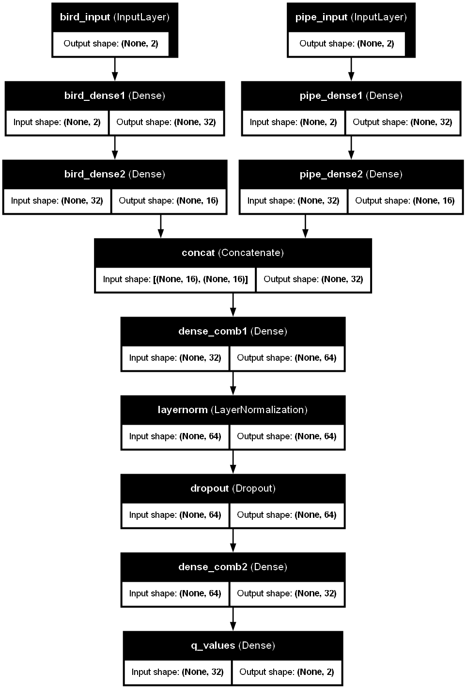

# Flappy Bird Reinforcement Learning (DQN)

This project implements a **Deep Q-Network (DQN)** to train an agent to play *Flappy Bird* using PyTorch.  
It combines a custom Pygame environment with prioritized experience replay, LayerNorm, and dropout for stability.

<p align="center">
  
</p>

---

## Project Structure

- **`GameInit.py`** – Flappy Bird environment (`FlappyBirdEnv`) and helpers used by the agent and training loop.
- **`train.py`** – The training/evaluation CLI, DQN model definition, Agent class, PER buffer, reward function, and utilities.
- **`dqn_tf_plot.png`** – Diagram of the model architecture used by the agent.

---

## Features

- Custom Pygame environment with frame skipping, adjustable pipe gap, and optional rendering.
- Deep Q-Network with two input branches (bird state and pipe-relative state), concatenated into joint layers with **LayerNorm** and **Dropout** for stability.
- **Prioritized Experience Replay (PER)** to sample informative transitions during training.
- Epsilon-greedy exploration with linear decay across episodes.
- TensorBoard logging (scores, rewards, epsilon, periodic eval) and periodic checkpointing.

---

## Model Overview

### State and Actions
- **State (size 4):** distance to ceiling, distance to floor, horizontal distance to next pipe, and vertical offset from the pipe gap center.
- **Actions (size 2):** `0 = no flap`, `1 = flap`.

### Network
- **Bird branch:** Linear(2→32) → ReLU → Linear(32→16) → ReLU  
- **Pipe branch:** Linear(2→32) → ReLU → Linear(32→16) → ReLU  
- **Combined:** Concat(16+16) → Linear(32→64) → ReLU → LayerNorm(64) → Dropout(0.2) → Linear(64→32) → ReLU → Linear(32→2).

### Reward Shaping (summary)
- Small survival reward; large positive for scoring.
- Alignment bonus for staying near the pipe gap center; slight bonus for forward progress and for fully passing a pipe.
- Small penalty per flap; penalties for hugging ceiling/floor; large penalty on death.

---

## Installation

```bash
git clone https://github.com/yourusername/flappy-dqn.git
cd flappy-dqn
